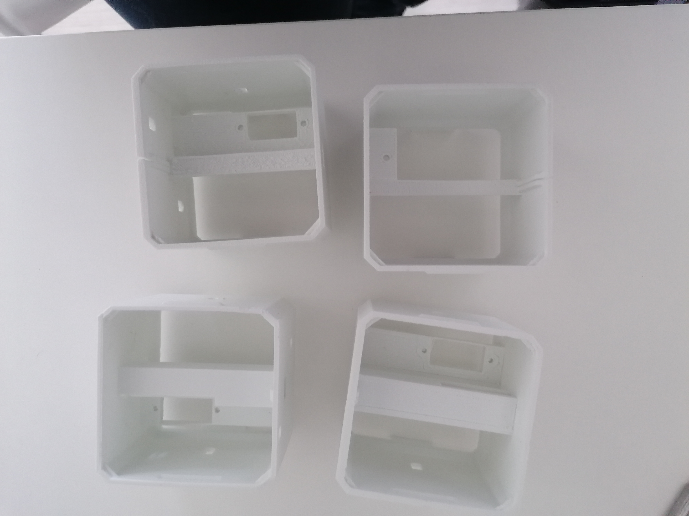

# Conception et prototypage

Dans cette partie je vais surtout parler des erreurs et des difficultés que nous avons pu rencontrer lors de la réalisation du projet. 

## Les erreurs  
Nos principales erreurs ont été lors de la modification du torse de notre Otto. Entre de mauvaises modélisations et de mauvaises impressions cela a était un véritable défi mais nous avons réussi. L’erreur la plus importante fut de ne pas modéliser un tunnel pour la langue pour guider son mouvement. Voici une photo des pièces défectueuses : 

## Les dificultees 
Les difficultés ont été surtout rencontrées lors de la programmation entre de nouveaux langages informatiques à apprendre et comprendre comment fonctionner le principe de programmer nous-même l’application qui nous permettrait de contrôler notre OTTO à distance. 
